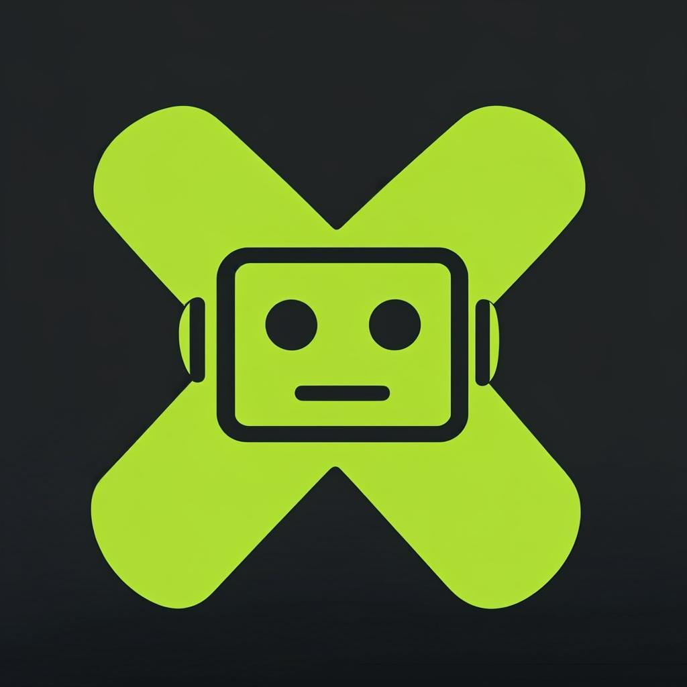

# xmarky — AI Chat Agent

<div align="center">



**An AI-powered conversational agent built with Next.js 16 and Nvidia NIM**

[](https://nextjs.org/)
[](https://www.typescriptlang.org/)
[](https://tailwindcss.com/)
[](https://build.nvidia.com/)

</div>

---

## Overview

**xmarky** is a production-ready AI chat agent that connects to [Nvidia NIM](https://build.nvidia.com/) to run the **Llama 4 Maverick** model. It features a polished dark-themed UI with streaming responses, markdown rendering, code syntax highlighting, and local conversation persistence.

### Key Features

- **Streaming Responses** — Real-time token-by-token output via SSE (Server-Sent Events)
- **Markdown & Code** — Full markdown rendering with syntax highlighting and one-click code copy
- **Conversation Persistence** — Chats are automatically saved to localStorage and restored on reload
- **Nvidia NIM Integration** — OpenAI-compatible API with `meta/llama-4-maverick-17b-128e-instruct`
- **Dark Theme** — Sleek dark UI with Nvidia green (`#76b900`) accent colors
- **Responsive Design** — Mobile-first, works on all screen sizes
- **Keyboard Shortcuts** — `Enter` to send, `Shift+Enter` for new line, `Ctrl+/` to focus
- **Tooltips & Guidance** — Contextual tooltips on all interactive elements
- **Modular Architecture** — Clean component separation for maintainability
- **Environment-based Config** — API keys via `.env.local`, never hardcoded

### Tech Stack

| Layer | Technology |
|-------|-----------|
| Framework | Next.js 16 (App Router, Server Components) |
| Language | TypeScript 5 |
| Styling | Tailwind CSS 4 + shadcn/ui |
| Animations | Framer Motion 12 |
| Markdown | react-markdown + react-syntax-highlighter |
| AI Backend | Nvidia NIM (OpenAI-compatible API) |
| Package Manager | Bun |

---

## Quick Start

### Prerequisites

- [Node.js 18+](https://nodejs.org/) or [Bun](https://bun.sh/)
- A [Nvidia NIM API key](https://build.nvidia.com/)

### Installation

```bash
# Clone the repository
git clone https://github.com/marktantongco/xmarky.git
cd xmarky

# Install dependencies
bun install

# Set up environment variables
cp .env.example .env.local
# Edit .env.local with your NVIDIA_API_KEY

# Start development server
bun run dev
```

Open [http://localhost:3000](http://localhost:3000) in your browser.

### Environment Variables

| Variable | Required | Default | Description |
|----------|----------|---------|-------------|
| `NVIDIA_API_KEY` | Yes | — | Your Nvidia NIM API key |
| `NVIDIA_MODEL` | No | `meta/llama-4-maverick-17b-128e-instruct` | Model to use |

---

## Project Structure

```
xmarky/
├── public/
│   ├── xmarky-logo.png          # App favicon and branding logo
│   └── robots.txt               # SEO robots configuration
├── src/
│   ├── app/
│   │   ├── api/
│   │   │   └── chat/
│   │   │       └── route.ts     # Backend API proxy to Nvidia NIM (SSE streaming)
│   │   ├── globals.css           # Tailwind v4 + shadcn theme variables
│   │   ├── layout.tsx            # Root layout, fonts, metadata
│   │   └── page.tsx              # Main chat UI (orchestrates all components)
│   ├── components/
│   │   ├── chat/
│   │   │   ├── code-block.tsx    # Syntax-highlighted code with copy button
│   │   │   ├── message-bubble.tsx # Chat message with markdown rendering
│   │   │   ├── suggestion-cards.tsx # Welcome screen suggestion prompts
│   │   │   ├── typing-indicator.tsx # Animated 3-dot loading indicator
│   │   │   └── xmarky-logo.tsx   # SVG logo component
│   │   └── ui/                   # shadcn/ui component library (35+ components)
│   ├── hooks/                    # Custom React hooks
│   └── lib/
│       ├── chat.ts               # Shared types, constants, storage helpers
│       ├── db.ts                 # Prisma client singleton
│       └── utils.ts              # Utility functions (cn helper)
├── .env.example                  # Environment variable template
├── .env.local                    # Your local env vars (git-ignored)
├── .gitignore                    # Git ignore rules
├── AGENTS.md                     # AI agent operating instructions
├── eslint.config.mjs             # ESLint flat config
├── next.config.ts                # Next.js configuration
├── package.json                  # Project manifest
├── postcss.config.mjs            # PostCSS config
├── tsconfig.json                 # TypeScript config
└── README.md                     # This file
```

---

## How It Works

### Architecture

```
┌──────────────┐      ┌──────────────┐      ┌──────────────────┐
│   Browser    │ SSE  │  Next.js API │ HTTPS│   Nvidia NIM     │
│  (React UI)  │◄────►│  /api/chat   │◄────►│  Llama 4 Maverick│
└──────────────┘      └──────────────┘      └──────────────────┘
       │                      │
       │ localStorage         │ .env.local
       │ (conversation)       │ (API key)
```

1. User sends a message from the React frontend
2. Frontend POSTs to `/api/chat` with the conversation history
3. The API route proxies the request to Nvidia NIM with streaming enabled
4. The response stream is parsed and forwarded as SSE to the frontend
5. Frontend renders tokens in real-time as they arrive
6. Completed conversations are persisted to localStorage

### API Route

The `/api/chat` route acts as a secure proxy — your Nvidia API key never reaches the browser. It accepts OpenAI-compatible chat completions format and returns SSE events:

```json
// Request
{
  "messages": [
    { "role": "user", "content": "Hello!" }
  ]
}

// SSE Response (streamed)
data: {"type":"delta","content":"Hello"}
data: {"type":"delta","content":"!"}
data: {"type":"done"}
data: [DONE]
```

---

## Keyboard Shortcuts

| Shortcut | Action |
|----------|--------|
| `Enter` | Send message |
| `Shift + Enter` | New line in input |
| `Ctrl + /` | Focus the input field |

---

## Deployment

### Vercel (Recommended)

1. Push your code to GitHub
2. Import the project at [vercel.com/new](https://vercel.com/new)
3. Add environment variables:
   - `NVIDIA_API_KEY` = your Nvidia NIM API key
   - `NVIDIA_MODEL` = `meta/llama-4-maverick-17b-128e-instruct` (optional)
4. Deploy

### Docker / Self-hosted

```bash
bun run build
NODE_ENV=production bun .next/standalone/server.js
```

The server runs on port 3000 by default.

---

## Customization

### Switching the AI Model

Edit `NVIDIA_MODEL` in your `.env.local` to use any model available on [Nvidia NIM](https://build.nvidia.com/):

```bash
# Examples
NVIDIA_MODEL=meta/llama-4-maverick-17b-128e-instruct
NVIDIA_MODEL=nvidia/llama-3.1-nemotron-70b-instruct
NVIDIA_MODEL=google/gemma-2-27b-it
```

### Changing the Theme

The accent color is defined in `src/lib/chat.ts`:

```typescript
export const ACCENT = '#76b900';      // Nvidia green
export const ACCENT_DIM = 'rgba(118, 185, 0, 0.15)';
```

### Adding Suggestion Prompts

Edit the `suggestions` array in `src/components/chat/suggestion-cards.tsx`.

---

## License

MIT

---

## Acknowledgments

- [Nvidia NIM](https://build.nvidia.com/) — AI model hosting
- [Next.js](https://nextjs.org/) — React framework
- [shadcn/ui](https://ui.shadcn.com/) — UI component library
- [Tailwind CSS](https://tailwindcss.com/) — Utility-first CSS
- [Framer Motion](https://www.framer.com/motion/) — Animation library
- [Vercel](https://vercel.com/) — Deployment platform
